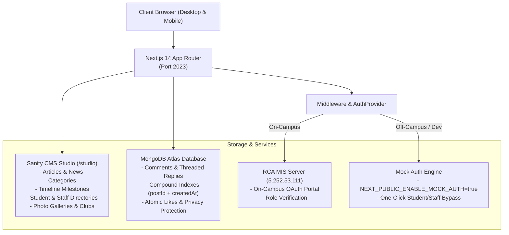

# 🏛️ RAEL — RCA Alumni, Editorial & Lifestyle Platform

> **The Official Digital Publication, Historical Archive & Member Directory of Rwanda Coding Academy**  
> *Built with Next.js 14 App Router, TypeScript, native MongoDB Driver, Sanity CMS, and Tailwind CSS.*

[](https://nextjs.org/)
[](https://www.typescriptlang.org/)
[](https://www.mongodb.com/)
[](https://www.sanity.io/)
[](https://tailwindcss.com/)

---

## 📖 Overview

**RAEL** (*RCA Alumni, Editorial, and Lifestyle Platform*) is the unified web portal and digital memory for **Rwanda Coding Academy**. It serves three core audiences:

1. **Students & Alumni**: Read campus publications, track cohort milestones, explore projects, browse photo galleries, and update professional profiles.
2. **Faculty & Staff**: Publish official institutional news, moderate student contributions, manage profile verification requests, and update academic promotions.
3. **Public & External Stakeholders**: Discover RCA's journey, student talent, institutional achievements, and press releases.

---

## ✨ Core Features

* **📰 Dynamic Editorial & News (`/rca-daily`, `/article/[slug]`)**: Category-filtered articles, rich PortableText rendering, and dynamic SSR fetching.
* **💬 High-Performance Threaded Discussions**: Pre-threaded server-rendered discussions backed by native MongoDB with B-Tree indexes, privacy-preserving pseudonymous commenting, and batch likes aggregation.
* **⏳ Institutional Timeline (`/timeline`)**: Interactive historical roadmap tracking RCA cohorts, milestones, and institutional breakthroughs.
* **👥 Community Directory (`/members`, `/members/[id]`)**: Searchable student and staff directory with parallel modal routing (`@modal/(.)members/[id]`).
* **🎨 Embedded Sanity Studio (`/studio`)**: Full-featured CMS studio directly embedded in the Next.js application for seamless content editing.
* **🔐 Dual-Mode Authentication (`/auth/login`)**:
  * **On-Campus Mode**: Integrated single sign-on with RCA MIS (*Management Information System*).
  * **Off-Campus Dev Mode**: One-click Mock Auth bypass allowing uninterrupted local development from home.

---

## 🏗️ System Architecture



---

## 🚀 Quick Start Guide

### 1. Prerequisites
Ensure your local development environment has:
* **Node.js**: `v18.x` or `v20.x LTS` (Node 22 is not recommended due to legacy package deprecations).
* **Package Manager**: `yarn` (v1.22+) or `npm`.
* **Git** installed on your system.

### 2. Clone & Install
```bash
# 1. Clone repository
git clone https://github.com/rca-dream-team/rael_V2.git
cd rael

# 2. Install dependencies
yarn install
# or: npm install
```

### 3. Configure Environment Variables
Create a `.env` file at the root of the project:
```bash
cp .env.example .env
```
*(Or create `.env` manually using the [Environment Variables](#-environment-variables) template below).*

### 4. Initialize Database Indexes
Run the idempotent MongoDB index script to ensure fast query times and concurrency safety:
```bash
yarn db:indexes
```

### 5. Launch Development Server
```bash
yarn dev
```
Open **[http://localhost:2023](http://localhost:2023)** in your browser.  
*(Note: RAEL runs on port `2023` by default to avoid conflicts with standard port 3000 services).*

---

## ⚙️ Environment Variables

Create a `.env` file in the project root with the following keys:

```env
# ==============================================================================
# Database Configuration (MongoDB Atlas)
# ==============================================================================
# Connection string for comments, replies, and likes
RAEL_DATABASE_URL="mongodb+srv://<username>:<password>@cluster.mongodb.net/rael"

# ==============================================================================
# Sanity CMS Configuration
# ==============================================================================
NEXT_PUBLIC_SANITY_PROJECT_ID="rrmy9xks"
NEXT_PUBLIC_SANITY_DATASET="production"
SANITY_TOKEN="<sanity_api_write_token>"
NEXT_PUBLIC_TOKEN="<sanity_api_read_token>"

# ==============================================================================
# RCA MIS (Management Information System) Endpoints
# ==============================================================================
# Internal on-campus network endpoints for authentication & profile sync
NEXT_PUBLIC_MIS_API_URL="http://5.252.53.111:6543/api/v1"
NEXT_PUBLIC_MIS_URL="http://5.252.53.111:9099"

# ==============================================================================
# Security & Application Settings
# ==============================================================================
# Secret key used for signing session JWTs
JWT_SECRET="<your_secure_random_jwt_secret>"

# Local application URL
NEXT_PUBLIC_APP_URL="http://localhost:2023"

# ==============================================================================
# Developer Experience / Off-Campus Bypass
# ==============================================================================
# Enable Mock Auth for local development when not on campus Wi-Fi
NEXT_PUBLIC_ENABLE_MOCK_AUTH="true"
```

### Variable Reference Table

| Variable | Required | Description |
| :--- | :---: | :--- |
| `RAEL_DATABASE_URL` | **Yes** | MongoDB connection URI for discussions and comment likes. |
| `NEXT_PUBLIC_SANITY_PROJECT_ID` | **Yes** | Sanity project identifier (`rrmy9xks`). |
| `NEXT_PUBLIC_SANITY_DATASET` | **Yes** | Sanity dataset name (`production`). |
| `SANITY_TOKEN` | **Yes** | Write-privileged token for creating profile and member records. |
| `NEXT_PUBLIC_TOKEN` | **Yes** | Read-privileged token for querying Sanity datasets. |
| `NEXT_PUBLIC_MIS_URL` | On-Campus | Base URL of RCA MIS login portal (`5.252.53.111:9099`). |
| `NEXT_PUBLIC_MIS_API_URL` | On-Campus | Base REST API URL of RCA MIS backend (`5.252.53.111:6543/api/v1`). |
| `JWT_SECRET` | **Yes** | Cryptographic secret used by Route Handlers to sign session tokens. |
| `NEXT_PUBLIC_APP_URL` | **Yes** | Base URL of the local or deployed application (`http://localhost:2023`). |
| `NEXT_PUBLIC_ENABLE_MOCK_AUTH` | Dev Only | Set to `"true"` to enable one-click dev login when developing off-campus. |

---

## 🔑 Authentication Architecture

RAEL features a resilient dual-mode authentication workflow:

### Mode 1: On-Campus Production Flow (RCA MIS)
When connected to the campus network or VPN:
1. User clicks **"Login With MIS"** on `/auth/login`.
2. Browser redirects to the RCA MIS portal at `http://5.252.53.111:9099`.
3. MIS verifies identity and returns an OAuth token.
4. Next.js Route Handler (`POST /api/auth/login`) syncs the user profile with Sanity CMS and signs a secure `rael_token` cookie.

### Mode 2: Off-Campus Mock Development Flow
When developing from home or outside the RCA campus network (`5.252.53.111` is unreachable):
1. Ensure `NEXT_PUBLIC_ENABLE_MOCK_AUTH="true"` in `.env`.
2. Navigate to **`http://localhost:2023/auth/login`**.
3. A styled **Developer Mode Active** card will appear.
4. Click **"Dev Student"** or **"Dev Staff"** to instantly sign in with simulated credentials.
5. All protected pages, profile workflows, comment authoring, and likes are fully functional without network timeouts.

---

## 📜 Available Scripts

| Command | Action |
| :--- | :--- |
| `yarn dev` | Starts Next.js development server at `http://localhost:2023` |
| `yarn build` | Runs strict typechecking and compiles the production bundle |
| `yarn start` | Launches production server at `http://localhost:2024` |
| `yarn lint` | Runs ESLint analysis across all source files |
| `yarn format` | Formats all files using Prettier |
| `yarn db:indexes` | Creates optimized compound B-Tree indexes on MongoDB Atlas |
| `yarn deploy-sanity`| Deploys the latest Sanity schema to the Sanity cloud dashboard |

---

## 📁 Repository Directory Map

```
rael/
├── scripts/                    # Database migrations & collection maintenance scripts
│   ├── init-indexes.js         # Compound index builder for MongoDB
│   └── create-collection.js    # MongoDB collection initialization
├── src/
│   ├── app/                    # Next.js 14 App Router
│   │   ├── (app)/              # Public application routes (News, Timeline, Gallery, Members)
│   │   ├── (cms)/studio/       # Embedded Sanity Studio CMS (/studio)
│   │   ├── @modal/             # Parallel & intercepting routes (Member profile modal)
│   │   ├── api/                # Unified App Router Route Handlers (/api/auth, /api/comments)
│   │   └── auth/               # Authentication pages (/auth/login, /auth/logout)
│   ├── components/             # Reusable UI component library (Cards, Modals, Navbar, Footer)
│   ├── contexts/               # React Context Providers (AuthProvider)
│   ├── lib/                    # Core utilities, MongoDB client, and Mock Auth engine
│   ├── sanity/                 # Sanity Studio schemas, GROQ queries, and client configuration
│   └── types/                  # Strict TypeScript interfaces (Comment, Member, News, Staff)
├── public/                     # Static media, SVG assets, and institutional logos
├── .env                        # Local environment configuration (do NOT commit)
├── next.config.js              # Next.js production & image domain settings
├── package.json                # Project dependencies and script runner
└── tsconfig.json               # Strict TypeScript configuration
```

---

## 🛠️ Content Management with Sanity Studio

To access the editorial dashboard:
1. Start the application (`yarn dev`).
2. Navigate to **`http://localhost:2023/studio`**.
3. Log in with authorized RCA editorial credentials.
4. From the Studio, editors can:
   * Draft, schedule, and publish campus news articles.
   * Upload high-resolution photo galleries.
   * Manage student cohort rosters and staff titles.
   * Record institutional timeline milestones.

---

## 🤝 Contribution & Handover Guidelines

For incoming Rwanda Coding Academy maintainers and student contributors:

1. **Branching Strategy**: Always create feature branches from `main` (e.g. `feat/member-filtering` or `fix/comment-reaction`).
2. **Strict Type Safety**: `next.config.js` enforces `ignoreBuildErrors: false`. Always run `npx tsc --noEmit` before committing.
3. **Database Performance**: Always execute queries using the compound indexes specified in `scripts/init-indexes.js`. Never perform full collection scans.
4. **Security**: Never expose real student user IDs in public API responses or commit credentials to version control.

---

## ⚖️ License & Acknowledgements

Developed with ❤️ by the **RCA DreamTeam & Alumni Community** at **Rwanda Coding Academy** (*Nyabihu, Western Province, Rwanda*).
